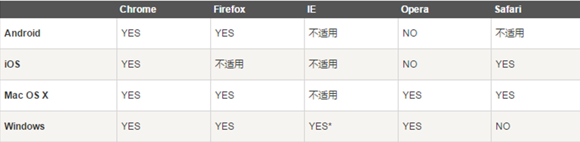

# Bootstrap-培训DEMO

## 一 为什么使用bootstrap？
> Bootstrap 是最受欢迎的 HTML、CSS 和 JS 框架，用于开发响应式布局、移动设备优先的 WEB 项目。由Twitter公司设计师Mark Otto和Jacob Thornton合作开发


## 二 浏览器支持
***下表为Bootstrap支持最新版本的浏览器和平台， ```注意``` [IE8及以上]


## 三 技术储备
+ HTML 了解基本的标签
+ CSS 了解样式优先级，样式选择器
+ js 熟悉DOM操作，ajax请求，事件代理机制
+ vscode开发工具使用（sublime&HBuilder）

## 四 下载地址
+ 中文 **[Bootstrap](https://getbootstrap.com)**
+ 英文 **[Bootstrap](https://www.bootcss.com)**

## 五 预编译样式(SASS|LESS)
+ sass[官网](https://sass-lang.com/)
+ less[官网](http://lesscss.org/)

## 六 可视化制作工具
+ Jetstrap **(https://jetstrap.com)**  
+ LayoutIt **(http://www.bootcss.com/p/layoutit)
+ bootswatchr**(http://bootswatchr.com)

## 七 demo实例
+ 全局样式+栅格布局
+ table表格
+ Form表单
+ Button按钮
+ pagenation分页
+ image图片
+ dropdown下拉
+ nav导航


